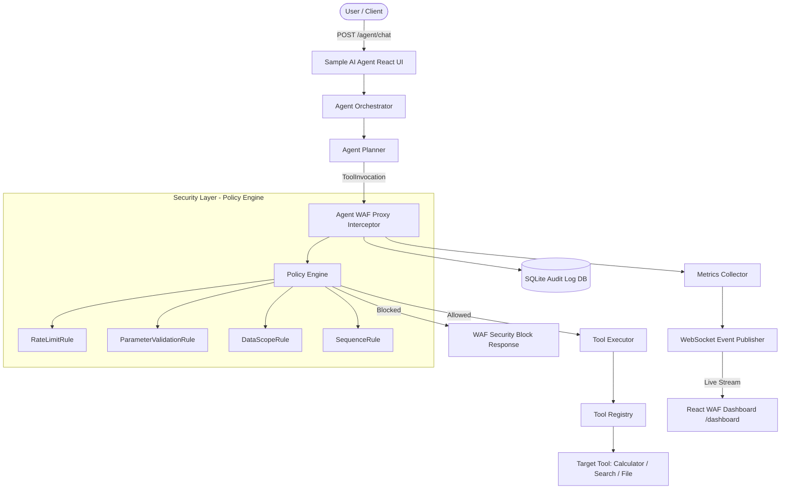

# Agent WAF — Web Application Firewall for AI Agents

An enterprise-grade, policy-enforcing security proxy layer that sits between AI Agents and their toolkits. It intercepts, evaluates, filters, logs, and audits every tool call invocation in real time before execution.

---

## 🏛️ System Architecture Diagram



---

## 🚀 Key Features & Security Rules

1. **Rate Limit Rule (`RateLimitRule`)**:
   - Limits per Agent + Tool execution velocity over a rolling sliding window (e.g. 5 calls/min).
2. **Parameter Validation Rule (`ParameterValidationRule`)**:
   - Recursively inspects payload fields to detect SQL Injection (`DROP TABLE`, `UNION SELECT`), Prompt Injection (`Ignore previous instructions`), Path Traversal (`../../../etc/passwd`), and oversized payloads.
3. **Data Scope Rule (`DataScopeRule`)**:
   - Confines resource access parameters (`filename`, `path`, `filepath`, `resource`) strictly within declared allowed scopes (e.g., `sample_data/`).
4. **Sequence Rule (`SequenceRule`)**:
   - Enforces session-based execution dependencies (e.g. `file_reader` must be preceded by a `search` in the same session).
5. **Real-time Monitoring Dashboard**:
   - Interactive React + Vite interface with live KPI cards, Recharts visualizations, live pipeline request flows, tool traffic counts, rule hit breakdown, and instant WebSockets streaming.
6. **Shadow Mode**:
   - Configurable `SHADOW_MODE=true` mode that logs violations as `would_block=true` without blocking actual execution.

---

## 🛠️ Quickstart & Local Setup

### Backend (FastAPI)
```bash
cd backend
python -m venv .venv
source .venv/bin/activate  # Or .venv\Scripts\activate on Windows
pip install -r requirements.txt
uvicorn main:app --reload
```
* API Server: `http://localhost:8000`
* Swagger OpenAPI Docs: `http://localhost:8000/docs`

### Frontend (React + Vite)
```bash
cd frontend
npm install
npm run dev
```
* Web Dashboard: `http://localhost:5173/dashboard`
* Sample AI Agent Chat: `http://localhost:5173/chat`

---

## 🧪 Running Automated Test Suite
```bash
python -m pytest backend/tests
```

## 🐳 Docker Deployment

To spin up the entire production-ready full stack environment (including the FastAPI backend, static React dashboard served via Nginx with security headers, and the reverse proxy) run:

```bash
docker compose up --build -d
```

- **React Dashboard & Chat Agent UI**: Access directly at `http://localhost/` (Port 80).
- **FastAPI OpenAPI Swagger**: Access directly at `http://localhost:8000/docs`.

---

## ☁️ AWS EC2 Production Deployment Guide

### 1. Prerequisites (Ubuntu 22.04 / 24.04 LTS)
Log into your AWS Ubuntu EC2 instance and install Docker and Docker Compose:
```bash
sudo apt update && sudo apt upgrade -y
sudo apt install -y docker.io
sudo systemctl enable --now docker
sudo usermod -aG docker $USER
# Log out and log back in to apply docker group membership
```

### 2. Project Setup
Clone the repository and copy the example environment configuration file to `.env`:
```bash
git clone https://github.com/Abi03122004/agent-waf.git
cd agent-waf
cp .env.example .env
```

### 3. Configuration
Edit the `.env` file to provide your production credentials:
```bash
nano .env
```
Provide the following values:
* `GROQ_API_KEY`: Your active Groq API Key.
* `ALLOWED_ORIGINS`: Set to your EC2 domain/IP (e.g. `http://your-ec2-domain.com,http://your-ec2-ip`).

### 4. Running the Application
Start the containers in daemon mode:
```bash
docker compose up --build -d
```
Docker will pull Node and Nginx base images, build the React frontend, compile the FastAPI backend, run health checks, and start the system. Nginx will bind to port 80 of your EC2 instance. Ensure your EC2 Security Group allows inbound HTTP traffic on port 80.

### 5. Updating the Application
To update the application after code changes are pushed to git:
```bash
git pull origin main
docker compose up --build -d
```
This pulls changes and incrementally rebuilds only the modified layers without losing SQLite audit database records (persisted via the external `sqlite_data` volume).

### 6. Automated CI/CD (GitHub Actions)
For production environments, automate deployments with a GitHub Actions workflow:
1. Store EC2 SSH keys (`EC2_SSH_KEY`), Host (`EC2_HOST`), Username (`EC2_USERNAME`), and your production `.env` contents in GitHub Repository Secrets.
2. Create a workflow `.github/workflows/deploy.yml` that:
   - Triggers on push to `main`.
   - SSHs into the EC2 instance.
   - Runs `git pull origin main`.
   - Re-applies the environment config.
   - Rebuilds and restarts the services: `docker compose up --build -d`.

### 7. Production Database Recommendation
> [!NOTE]
> This application currently uses **SQLite** for demo simplicity and local auditing. For large-scale production workloads, it is highly recommended to migrate the storage layer to a containerized or managed relational database like **PostgreSQL** (e.g., AWS RDS PostgreSQL) to support high concurrency, automated snapshots, and scaling.

---

## 📡 REST API Endpoint Summary

| Method | Endpoint | Description |
| :--- | :--- | :--- |
| `GET` | `/health` | Liveness health check |
| `GET` | `/ready` | Readiness check |
| `POST` | `/agent/chat` | Main Agent interaction endpoint |
| `GET` | `/metrics` | Returns in-memory WAF metrics & counters |
| `GET` | `/audit` | Retrieves historical audit logs from SQLite |
| `GET` | `/rules` | Lists registered security rules & config |
| `POST` | `/rules/reload` | Reloads rules configuration |
| `WS` | `/dashboard/ws` | Live WebSocket event stream |

---

## 🛡️ Enterprise Confidentiality
* Developed for **Agent WAF Security System**.